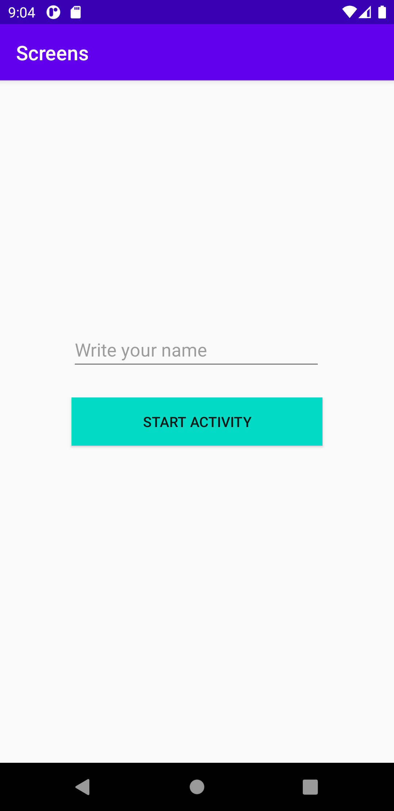
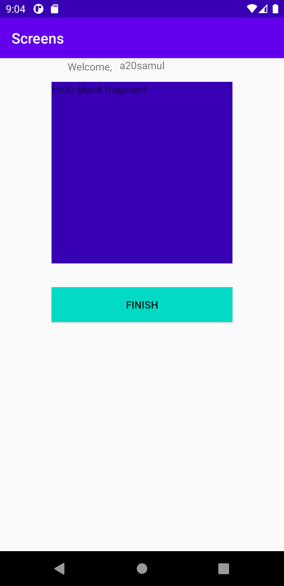
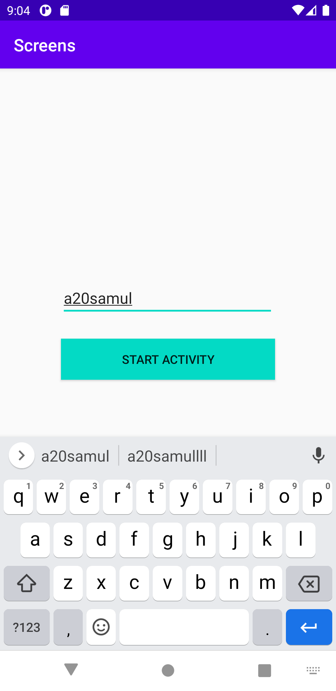

# Rapport

**1. Added a second activity to the forked app Screens**
En second activity tillades för att kunna byta mellan vyer. Detta åstadkoms genom
 File --> New --> Activity --> Empty activity.


**2. Added a button in the first activity which led to the second activity.**
Den första aktiviteten var namngiven MainActivity medan den andra namngavs SecondActivity.
En Button tillades i activity_main.xml vilken innehöll ett id samt dess positionering och färg,
genom nedanstående kod:

```
    <Button
        android:id="@+id/start_button"
        android:layout_width="250dp"
        android:layout_height="wrap_content"
        android:text="Start Activity"
        android:background="@color/colorAccent"
        app:layout_constraintBottom_toBottomOf="parent"
        app:layout_constraintTop_toTopOf="parent"
        app:layout_constraintLeft_toLeftOf="parent"
        app:layout_constraintRight_toRightOf="parent" />
```

Denna button länkades till SecondActivity genom nedanstående kod vilken initialt refererar till knappen start_button genom variabeln startButton.
Därefter leddes intentionen av att från MainActivity ta sig vidare till SecondActivity vid nedtryckning(onClick) .
MainActivity.this signalerar att det var därifrån den härstammade för att vidare ta sig till den andra parametern
vilken bestod utav SecondActivity.class. Denna intent startades genom startActivity(intent);.

```
        Button startButton = findViewById(R.id.start_button);
        startButton.setOnClickListener(new View.OnClickListener() {
            @Override
            public void onClick(View view) {
                Intent intent = new Intent(MainActivity.this, SecondActivity.class);
                startActivity(intent);
                Log.d("TAG", "Start SecondActivity");
            }
```


_Bild 1: Demonstrerar knappen vilken lades till i MainActivity vilken ledde vidare till SecondActivity_


**3. Add a fragment in the second activity which contains at least one widget.**
Ett fragment tillades till applikationen genom File --> New --> Fragment --> Fragment (Blank).
Fragmentet angavs ett id, dess ursprungsläge vilken var com.example.screensBlankFragment samt  dess
positionering och tillades inuti activity_second.xml genom koden:

```
    <fragment
        android:id="@+id/fragment"
        android:name="com.example.screens.BlankFragment"
        android:layout_width="250dp"
        android:layout_height="250dp"
        android:tag="blank_fragment"
        app:layout_constraintBottom_toTopOf="@+id/finish_button"
        app:layout_constraintEnd_toEndOf="parent"
        app:layout_constraintStart_toStartOf="parent"
        app:layout_constraintTop_toTopOf="parent" />
```

Därefter tillades widgeten Button med id finish_button, likt föregående button (Se steg 2 ovan)
i activity_second.xml. Denna knapp implementerades för att kunna avsluta applikationen genom finish(); med hjälp
av nedanstående kod vilken anger att vid klick av knappen som finns belägen i activity_second och uppvisas i SecondActivity,
ska det leda till avslut av applikation vilket returnerar användaren tillbaka till MainActivity. Finish användes
istället för ny intent för att spara på minne då nya sidorna staplas ovanpå varandra vid returnering
och en ny screen skapas vid varje intent.

```
        Button finishButton = findViewById(R.id.finish_button);
        finishButton.setOnClickListener(new View.OnClickListener() {
            @Override
            public void onClick(View view) {
                Log.d("END", "Finish app");
                finish();

            }
        });
```


_Bild 2: Demonstrerar SecondActivity med finishknapp och fragment._


**4. Extra Tillägg och modifiering av applikation**
Ytterligare komponenter tillades i applikationen för att göra den mer interaktiv.
Däribland ingick EditView i MainActivity där användaren kunde ange sitt namn. Vid angivning av namn
uppvisades "Welcome," + angivet namn upp i SecondActivity efter knappklick. Detta åstadkoms med hjälp av nedanstående kod.

i MainActivity; EditView med id myNewEdt implementerades och skickade med datan som inmatats.
datan angavs id name där den inmatade datan myNewedt skickades med.

```
public class MainActivity extends AppCompatActivity {

    @Override
    protected void onCreate(Bundle savedInstanceState) {
        super.onCreate(savedInstanceState);
        setContentView(R.layout.activity_main);

        final EditText myNewEdt = findViewById(R.id.myNewEdt);

        Button startButton = findViewById(R.id.start_button);
        startButton.setOnClickListener(new View.OnClickListener() {
            @Override
            public void onClick(View view) {
                String myNewEdtText = myNewEdt.getText().toString();
                Log.d("TAG", "Start SecondActivity" + myNewEdtText);

                Intent intent = new Intent(MainActivity.this, SecondActivity.class);
                intent.putExtra("name", myNewEdtText);
                startActivity(intent);
            }
        });

    }
}
```

I SecondActivity; genom intent hämtades strängen vilken angavs vid tidigare skede i EditText och
implementerade den inuti en TextView med id text där den sattes genom setText. (Se bild 1, 2 och 3)
Om intent finns så hämtades datan av typen sträng med id name.

```
  @Override
    protected void onCreate(Bundle savedInstanceState) {
        super.onCreate(savedInstanceState);
        setContentView(R.layout.activity_second);

        String name = "";

        Intent intent = getIntent();
        if (intent != null){
            String temp = intent.getStringExtra("name");
            if (temp != null) {
                name=temp;
            }
        }

        TextView text = findViewById(R.id.text);
        text.setText(name);
```

_Bild 3: Demonstrerar inskrift av namnsträng, se uppvisande av namn i SecondActivity i bild 2._


